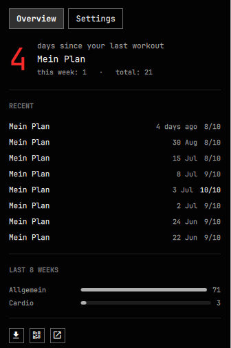
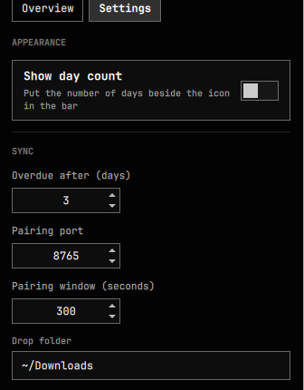

# GoTrain for Omarchy

Brings workout data from [GoTrain](https://niclick.org/GoTrain) — a
backend-less PWA that keeps everything in one browser `localStorage` key — onto
an Omarchy desktop, and keeps it there.

A bar pill shows the weight-lifting icon, turning urgent once you are overdue.
Clicking it opens recent sessions, this week's count and an eight-week muscle
balance, plus a Settings tab. A `gotrain` CLI does the same from a terminal.

Nothing syncs on its own: there is no daemon, no timer, and no background
network traffic. You move the data when you want to.

| Overview | Settings |
|---|---|
|  |  |

## Getting data across

GoTrain has no server, so "sync" means getting `tp4_state` off the phone.
Three routes, in the order you will probably want them:

**Share sheet.** In GoTrain: Settings → Data → *Send to PC*. Pick LocalSend
(or AirDrop) and send it here. Then `gotrain sync`, or the ⤓ button in the
panel, picks up the newest export from `~/Downloads`. Encrypted, no size
limit, and nothing to set up beyond LocalSend on both ends.

**Pairing code.** Run `gotrain pair` (or the QR button in the panel). It
prints a QR code and listens on your LAN for one transfer, then exits. In
GoTrain: Settings → Data → *Scan PC code*. The code carries the newest
workout this machine already holds, so a routine sync sends only what
changed — a single workout is well under a kilobyte.

Worth knowing: that transfer is plain HTTP across your local network. Anyone
on the same Wi-Fi could read it. The share sheet route is encrypted; prefer it
when you have the choice.

**A file.** `gotrain import path/to/export.json` takes whatever arrives by any
other means — a cable, an email to yourself, a browser download.

## Firewall

Omarchy denies incoming connections by default — its installer opens exactly
one port for device-to-device transfer, `53317` for LocalSend. The pairing
receiver uses `8765`, so it needs one rule before a phone can reach it:

```bash
sudo ufw allow 8765/tcp comment 'gotrain pair'
```

Without it the phone just reports "cannot connect": ufw drops the SYN and
nothing on this side ever sees a request. `gotrain pair` checks for the rule
and refuses to print a QR code that cannot work; `gotrain doctor` explains
why, and will name the address that was blocked and when.

Nothing listens on the port except during the few minutes `gotrain pair` is
running, and the receiver wants a 128-bit token and serves exactly one
transfer, so an idle open port simply refuses connections.

The share sheet route needs no rule of its own — LocalSend's port is already
open.

## Commands

| Command | What it does |
|---|---|
| `gotrain sync` | Import the newest export from the watch folders |
| `gotrain import FILE…` | Import specific files |
| `gotrain pair [--port N]` | Show a QR code and receive one transfer |
| `gotrain doctor` | Why the phone cannot reach this machine |
| `gotrain config list\|get\|set` | Show or change settings |
| `gotrain status [--json]` | Days since last workout, this week, total |
| `gotrain list [-n N]` | Recent workouts |
| `gotrain show ID` | One workout, exercise by exercise |
| `gotrain stats` | Totals, date span, muscle groups, frequent exercises |
| `gotrain export [-o FILE]` | Write a merged `tp4_state` to load back into GoTrain |

## Settings

The popup has two tabs. **Settings** covers everything worth tuning:

| Setting | Effect | Stored in |
|---|---|---|
| Show day count | Adds `4d` beside the icon in the bar | `shell.json` bar entry |
| Overdue after | Days before the icon turns urgent | `config.json` |
| Pairing port | Port `gotrain pair` listens on | `config.json` |
| Pairing window | How long `pair` waits before giving up | `config.json` |
| Drop folder | Where `gotrain sync` looks for exports | `config.json` |

Appearance lives on the bar entry, because it is presentation and applies the
moment you click. Everything else lives in the CLI config so a terminal
`gotrain status` can never disagree with the pill about whether you are
overdue.

The same settings from a terminal:

```bash
gotrain config list
gotrain config set staleDays 5
gotrain config get port
```

`config set` validates ranges and rejects unknown keys, and only writes what
differs from the defaults — so an untouched install has an empty (or absent)
config file. Change the pairing port and you will need a matching firewall
rule; the tab says so, and `gotrain doctor` will confirm it.

The day count is only hidden, not lost: it stays in the pill's tooltip
alongside the last plan name and this week's total.

Two IPC entry points, for keybindings:

```bash
omarchy-shell nicklyk.gotrain settings     # open straight to the Settings tab
omarchy-shell nicklyk.gotrain toggleDays   # show/hide the day count
```

## Where things live

```
~/.local/share/gotrain/gotrain.db      SQLite archive
~/.local/share/gotrain/snapshots/      every raw import, kept verbatim
~/.config/gotrain/config.json          watch folders, port, thresholds
```

Workouts are keyed by GoTrain's own history id and merged, never replaced. A
phone-side reset, a pruned history, or switching between the home screen app
and Safari cannot remove what this machine already recorded — which is also
why `gotrain export` is useful: it writes a merged state you can load back
into either.

Config keys: `watchDirs`, `watchGlobs`, `port`, `maxUrlPayload`, `pairTimeout`,
`staleDays`, `origin`, `appUrl`.

## Requirements

| | |
|---|---|
| Omarchy | 4.x (Quickshell shell with plugin support) |
| Python | 3.9+, **standard library only** — no pip packages |
| `qrencode` | only for `gotrain pair`; everything else works without it |
| LocalSend | optional, on both devices, for the share-sheet route |

No build step, no runtime dependencies to install, no network access except
the pairing receiver you start yourself.

## Install

```bash
omarchy plugin add https://github.com/nicklyk/omarchy-gotrain.git --enable
ln -s ~/.config/omarchy/plugins/nicklyk.gotrain/bin/gotrain ~/.local/bin/gotrain
```

The symlink has to live outside the plugin directory — `omarchy plugin
validate` rejects symlinks inside one. It is optional; it only puts `gotrain`
on your `PATH`, and the widget always calls its own bundled copy.

If you want the pairing code to work, open the port once:

```bash
sudo ufw allow 8765/tcp comment 'gotrain pair'
```

## Removal

```bash
omarchy plugin remove nicklyk.gotrain
rm -f ~/.local/bin/gotrain
sudo ufw delete allow 8765/tcp          # only if you added the rule
```

That leaves your workout archive alone. To delete that too:

```bash
rm -rf ~/.local/share/gotrain ~/.config/gotrain
```

## What it writes

Nothing is changed without you asking for it:

- `~/.local/share/gotrain/` — the workout archive and raw snapshots, written
  when you import.
- `~/.config/gotrain/config.json` — created the first time you change a
  setting, and only holds keys that differ from the defaults.
- `~/.config/omarchy/shell.json` — only the plugin's own bar entry, and only
  when you toggle *Show day count*. No other part of the file is touched.

It never edits your firewall, never installs packages, and never runs anything
at boot or on a timer.

## iOS notes

The home screen web app and Safari keep **separate** `localStorage`
containers, so each holds its own independent history. GoTrain warns before
sending a state that still looks like a fresh install, which is what you would
see if you opened the wrong one. The desktop archive merges both.

Safari has no `BarcodeDetector`, so GoTrain inlines
[jsQR](https://github.com/cozmo/jsQR) (Apache-2.0) to scan the pairing code,
and no Local Network Access, so the transfer is a top-level navigation rather
than a `fetch` — a plain `fetch` to a LAN address is blocked as mixed content
from an HTTPS page.

## License

MIT.
